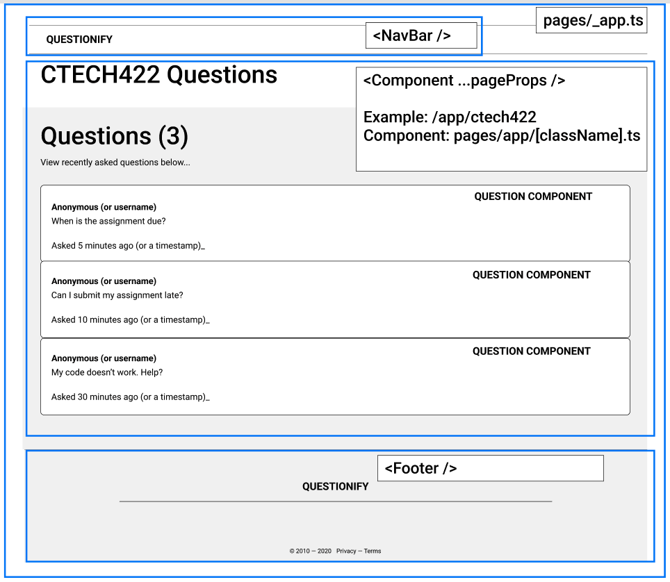

# Navigating between Pages

By the end of this section, you'll be able to create new pages and navigate between pages using the functionality built into the NextJS Page Router.

## Creating New Pages

NextJS features a file-based routing system, so you can create multiple pages in your app by creating a new file that defines a React component.

To define the main page in your application, create a `pages/index.js` - this is provided by default if you're following along. This page currently displays a Hello World page provided by NextJS.

`pages/index.js` defines the content displayed at the root URL of your app.

To define a new page in your application, create a new file named `pages/about-us.js` to create a new page named `/about-us` and make sure that it defines a React component.

```jsx title="pages/about-us.js"
export default function AboutUs() {
  return (
    <h1>Hello from About Us</h1>
  )
}
```

The important part of this snippet is the `export default function AboutUs() { ... }`.

This snippet tells NextJS that this file "exports" a function named `AboutUs` that returns a React component.

The name of the page is determined by the name of the file, in this case, `pages/about-us.js` defines a page named `/about-us` whereas `pages/AboutUs.js` would define a page named `/AboutUs`.

The function name `function AboutUs() { ... }` is used to display useful error messages.

Here's how all the different pages work within your project

```mermaid
flowchart LR
    p1["pages/"]
    p1 --> index["index.ts"] --> url1["localhost:3000/"]
    p1 --> view["app/[className].ts"] --> url2["localhost:3000/app/my-class-name"]
    subgraph app["pages/_app.ts"]
        index
        view
        p1
    end
```

`pages/_app.ts` is a file used by NextJS which is responsible for showing the current component meant for the page. It allows you to "wrap" your pages with any additional code you might need across multiple pages.

Each page is then available at its own URL using conventions such as `pages/index.ts` which is available at `localhost:3000/` - notice how the URL ends in `/` which NextJS automatically routes to `pages/index.ts`.

## Creating Custom Components like a Nav Bar

One benefit here of using React is that we can easily tie into the NextJS system, and easily share components across different parts of your app.

For example, you could create a navigation bar that displays on all of your pages.

```jsx title=NavBar.js
export default function NavBar() {
  return (
    <nav>...</nav>
  )
}
```

And then you could use that component in `pages/_app.js` which contains all the components that display on every page in your app.

```jsx title=pages/_app.js
import NavBar from '../components/NavBar'

export default function App({ Component, pageProps }) {
  return (
    <div>
      <NavBar />
      <Component {...pageProps} />
    </div>
  )
}
```
Here, we imported NavBar and made it a sibling of `Component` which in this case, refers to the component for the page that is currently being viewed. This is a useful pattern for sharing things like a NavBar and a Footer across pages.



Note: Its a useful to create your React components in a folder called src/components, and then have your Pages import React components from that folder.

## Using Path Parameters

Sometimes, you might want to display some data thats based on something in the URL - so we can tell users to navigate to `my-project.example.com/app/cs5356`` in order to view the app specifically for cs5356.

You can use Path Parameters as a way of parameterizing the page using NextJS by creating a new Page for it - something like `/src/pages/app/[className].js`.

Then, you can get that data from within your Page component by using the NextJS Router object.


```jsx title=/src/pages/app/[className].js
import { useRouter } from 'next/router'

export default function ClassPage(props) {
  const router = useRouter()

  const className = router.query.className
  
  // do something useful with the className
  // ...
}
```

If you'd like to learn more about this, take a look at the NextJS docs for [Dynamic Routes](https://nextjs.org/docs/pages/building-your-application/routing/dynamic-routes)